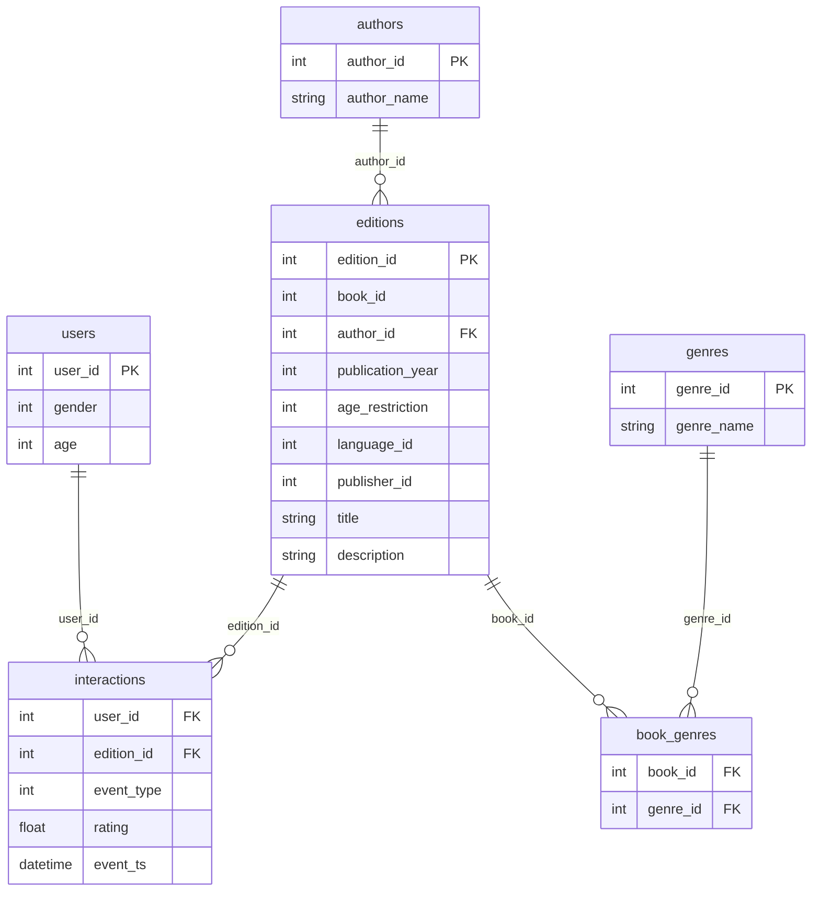

# Описание данных (Финал)

## Схема данных

---

## Описание файлов

### `interactions.csv`

Наблюдаемый лог взаимодействий пользователей после частичной потери событий. Каждая строка — одно событие.

| Field | Description | Comment |
|-------|-------------|---------|
| `user_id` | идентификатор пользователя (FK → `users.user_id`) | - |
| `edition_id` | идентификатор издания (FK → `editions.edition_id`) | - |
| `event_type` | тип события: `1` — wishlist, `2` — read | - |
| `rating` | рейтинг (только для `read`, иначе `NULL`) | - |
| `event_ts` | дата-время события | - |

### `targets.csv`

Список пользователей, для которых нужно восстановить потерянные позитивные взаимодействия.

| Field | Description | Comment |
|-------|-------------|---------|
| `user_id` | идентификатор пользователя | один столбец |

### `editions.csv`

Справочник изданий (edition-level). Каждое издание привязано к одной книге.

| Field | Description | Comment |
|-------|-------------|---------|
| `edition_id` | идентификатор издания (PK) | - |
| `book_id` | идентификатор книги | - |
| `author_id` | идентификатор автора (FK → `authors.author_id`) | - |
| `publication_year` | год публикации | издания, не книги |
| `age_restriction` | возрастное ограничение | например, 18+ |
| `language_id` | идентификатор языка | справочник отсутствует |
| `publisher_id` | идентификатор издателя | справочник отсутствует |
| `title` | название | - |
| `description` | описание | текст |

### `authors.csv`

Справочник авторов.

| Field | Description | Comment |
|-------|-------------|---------|
| `author_id` | идентификатор автора (PK) | - |
| `author_name` | имя автора | ФИО или псевдоним |

### `genres.csv`

Справочник жанров.

| Field | Description | Comment |
|-------|-------------|---------|
| `genre_id` | идентификатор жанра (PK) | - |
| `genre_name` | название жанра | - |

### `book_genres.csv`

Связь многие-ко-многим между книгами и жанрами.

| Field | Description | Comment |
|-------|-------------|---------|
| `book_id` | идентификатор книги | - |
| `genre_id` | идентификатор жанра (FK → `genres.genre_id`) | - |

### `users.csv`

Справочник пользователей с демографическими признаками.

| Field | Description | Comment |
|-------|-------------|---------|
| `user_id` | идентификатор пользователя (PK) | - |
| `gender` | пол: `1`, `2` или `NULL` | - |
| `age` | возраст (может быть `NULL`) | - |
